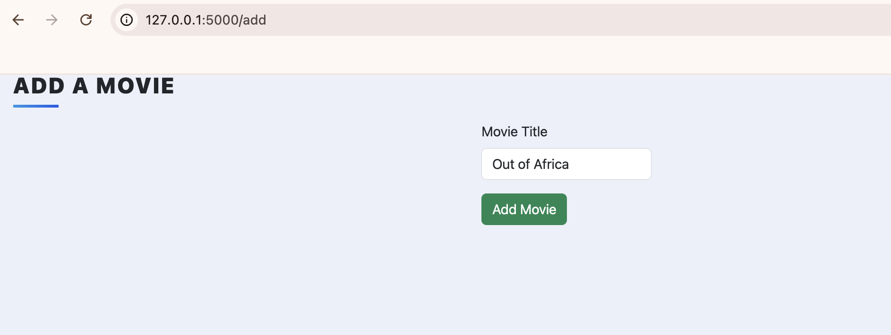
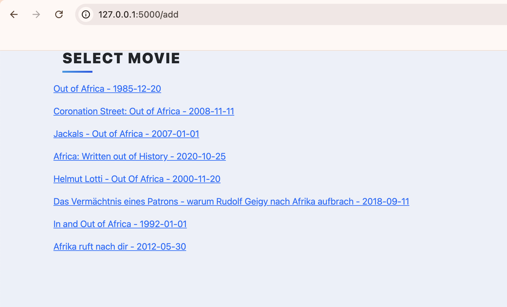
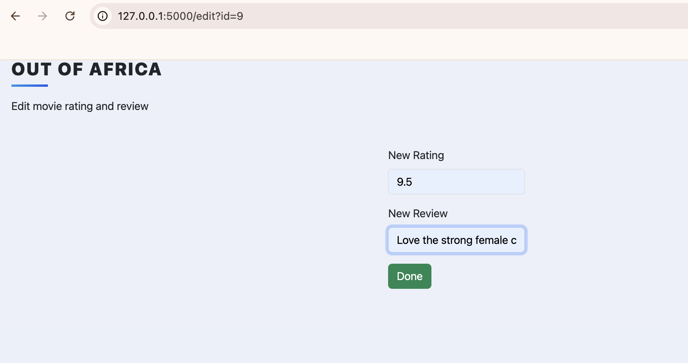
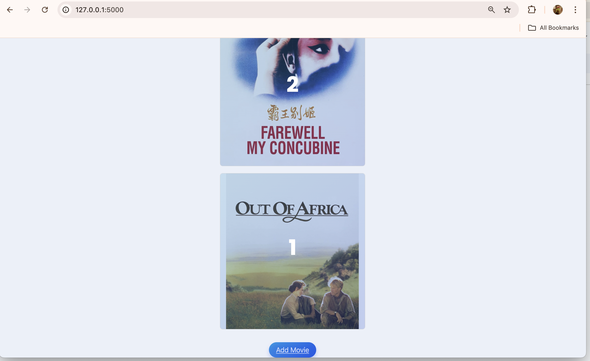

## My Top 10 Movies Website (Udemy Course: Day 64)

|  | Description |
| ----------- | ----------- |
| Project purpose | To build a website using Flask/WTForms/SQLite/SQLAlchemy and more. It will allow us to create a beautiful website that lists our top 10 films of all time. As we watch more movies, we can always update our list and keep track of which movies to recommend people.|
| Languages | Python, HTML, CSS |
| Python Libraries | Flask, Flask-Bootstrap (BS 5), SQLAlchemy, Jinja, WTForms |

Codes Summary (how does it work):
-
- Webform was built with WTForms and Flask-Bootstrap5.
- With API Request to TMDB, retrieve all related movie titles and render on the website using Jinja.
- Once the correct title is chosen, store the movie attributes such as poster url, overview text in SQLAlchemy.
- The homepage render the movie ranking display via Jinja and entries from the SQLAlchemy database.  

How to run the file:
-
Clone the repo and execute main.py.
Go to your browser and paste the local port address --> http://127.0.0.1:5000.

<video width="320" height="240" controls>
  <source src="images/topmovies_video.mp4" type="video/mp4">
</video>

Homepage.

To add a movie, click on "Add Movie" and enter the movie title. 

Movies with similar title will be searched from [TMDB website](https://www.themoviedb.org/). Click on the title you would like to add. 

Add a rating and a short review about this movie. 

The newly added movie will now be displayed on the homepage by rank order. 

